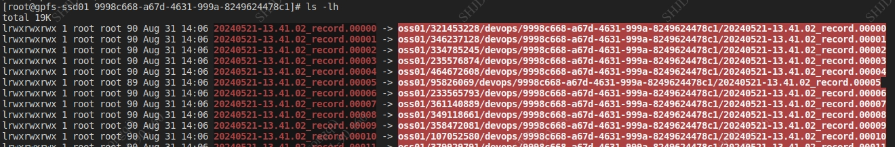
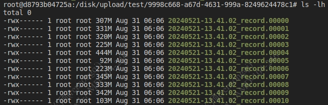

# gpfs-fuse

A GPFS External Storage VFS Based on Fuse

## Description

The container mounts the gpfs filesystem and gpfs fuse filesystem, the files in the gpfs are softlinks, and the files seen in the gpfs fuse are common files, and you can get the data corresponding to the files directly from minio when reading data in the gpfs fuse filesystem.

## Demo
gpfs file


gpfs-fuse file


## Getting started

1. Install dependencies on the host machine
```bash
apt install fuse3 -y
sudo sed -i 's/#user_allow_other/user_allow_other/g' /etc/fuse.conf
```

2. Build base image

```bash
cd image
docker build -t docker.io/ubuntu:22.04-fuse .
```

3. Build image

```bash
make build
```

4.  Testing

```bash
go build -ldflags="-s -w" -o gpfs-fuse
./gpfs-fuse -external ~/storage -mount /tmp/test
```

## Run

1. docker run
```bash
docker run -it -v /disk/upload:/disk/upload \
               --device /dev/fuse \
               --privileged \
               gpfs-fuse:2024-09-31-CST-160832 bash
```

2. docker-compose

```bash
version: '3.7'

services:
  your-service-name:
    image: gpfs-fuse:2024-09-31-CST-160832
    privileged: true
    devices:
      - /dev/fuse
    volumes:
      - /disk/upload:/disk/upload  # mount gpfs path
    command: your-command
```

3. k8s

```yaml
apiVersion: apps/v1
kind: Deployment
metadata:
  name: your-deployment-name
spec:
  replicas: 1
  selector:
    matchLabels:
      app: your-app-label
  template:
    metadata:
      labels:
        app: your-app-label
    spec:
      containers:
        - name: your-container-name
          image: gpfs-fuse:2024-09-31-CST-160832
          securityContext:
            privileged: true
          volumeMounts:
            - name: fuse-device
              mountPath: /dev/fuse
          command: ["your-command"]
      volumes:
        - name: fuse-device
          hostPath:
            path: /dev/fuse
            type: CharDevice  
```

# TODO

- [ ] Large file read performance needs to be optimized
- [ ] The way files are cached for reading needs to be optimized

# External storage alternatives

For external storage, seaweedfs is selected, and the seaweedfs file system is mounted into a subdirectory of the gpfs file system using the weed command